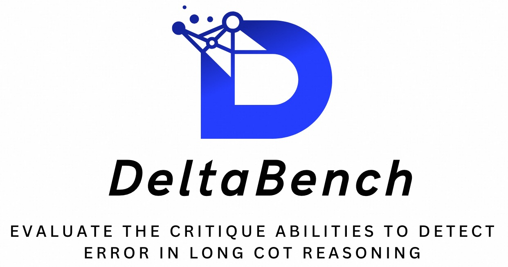
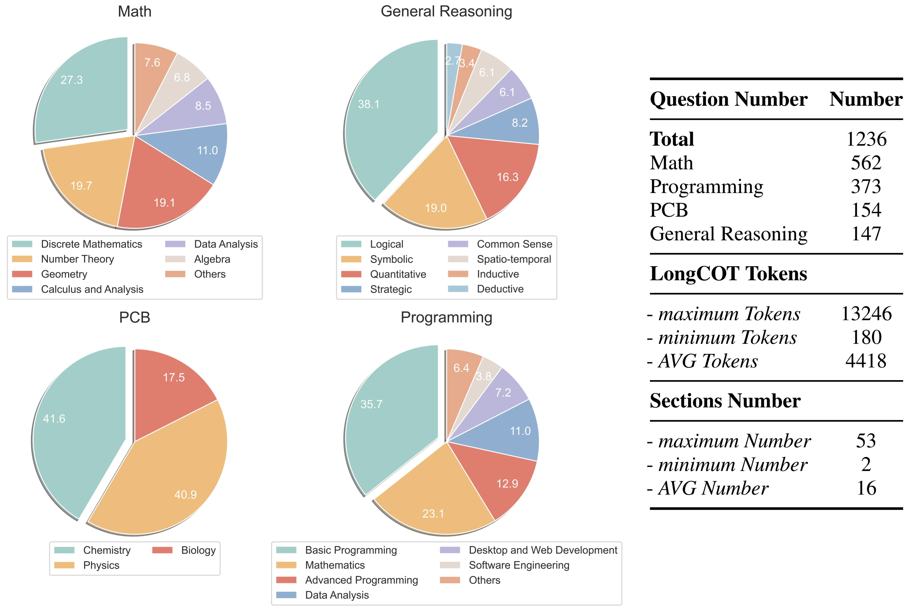
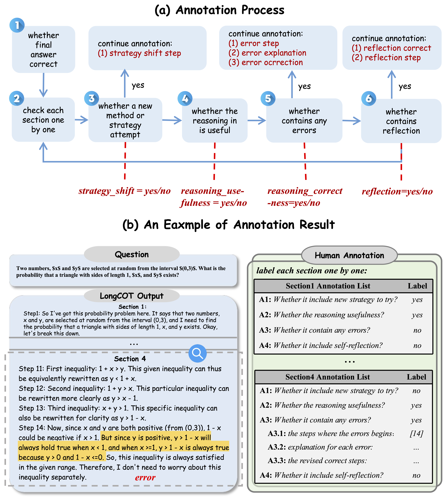
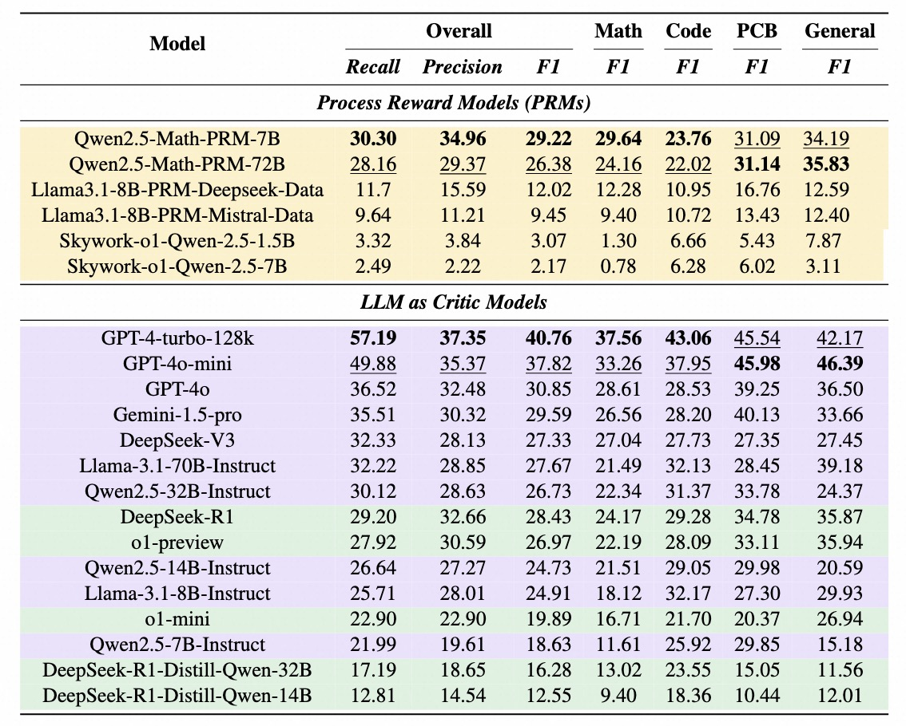

<p align="center">
  
</p>


# Overview


<p align="center">
  
</p>
<p align="center">
   🌐 <a href="https://openstellarteam.github.io/xxx/" target="_blank">Website</a> • 🤗 <a href="https://huggingface.co/datasets/OpenStellarTeam/xxx" target="_blank">Hugging Face</a> • ⏬ <a href="#data" target="_blank">Data</a> •   📃 <a href="https://huggingface.co/datasets/OpenStellarTeam/xxx" target="_blank">Paper</a>  <a href="xxx">   中文</a> | <a href="xxx">English 
</p> 


## 💥 DeltaBench

**DeltaBench** the first dataset to analyze the qualities of the long CoTs generated by o1-like models and evaluate the critique abilities to **D**etect **E**rror in Long Co**T** Re**A**soning of existing critic models and PRMs. Specifically, DeltaBench comprises 1,236 samples across diverse domains, including **Math**, **Programming**, **PCB** (physics, chemistry and biology), and **General Reasoning**. Each sample encompasses a problem, its corresponding long CoT solution, and comprehensive human annotations

 Please visit our [website](https://openstellarteam.github.io/xxx/) or check our [paper](https://arxiv.org/abs/2502.19361) for more details. 

<p align="center">
  
</p>

## 🆕 News

- **\[2025.02.27 soon\]** We will release the DeltaBench dataset in a week.

  

## 💫 Instroduction

* we introduceDeltaBench, the first dataset to analyze the qualities of the long CoTs generated by o1-like models and evaluate the critique abilities to **D**etect **E**rror in Long Co**T** Re**A**soning of existing critic models and PRMs. Specifically, in DeltaBench, we first collect a diverse collection of long CoTs generated by various o1-like models (i.e., QwQ, DeepSeek-R1, and Gemini-2.0 Flash Thinking) across different reasoning tasks such as **Math**, **Programming**, **PCB** (physics, chemistry and biology), and **General Reasoning**.
  Then, we divide each long COT into different sections, where each section denotes an independent subtask, as shown in Figure1. 

<p align="center">
  
  <figcaption style="text-align:center;">Figure 1: An example of dividing sections.</figcaption>
</p>
​	After that, each section includes the following tags:

* 1️⃣**Strategy Shift:** whether this section introduces a new method or strategy attempt. If a new strategy is introduced, the specific step is annotated.
* 2️⃣**Reasoning Usefulness:** whether the reasoning in this section is useful. 
* 3️⃣**Reasoning Correctness:** whether this section contains any errors. If an error is present, additional error-related fields are annotated, including the first step number at which the error occurs, explanation and correction.
* 4️⃣**Reflection Efficiency:** whether this section contains reflection and whether the reflection is correct. If reflection is present, the step at which the reflection begins is annotated.

<p align="center">
  
</p>


## 📊 Leaderboard

<p align="center">
  
</p>


## ⚖️ Evals

The startup command is as follows: 

- Step1: set your openai key in scripts/chinese_simpleqa_easy.py:

  ```
  os.environ["OPENAI_API_KEY"] = "replace your key here"
  os.environ["OPENAI_BASE_URL"] = "replace your key here"
  ```

- Step2: run the eval script:

  ```
  python evaluation.py <model_name>
  ```

- Step3: we also provide a unified processing script for multiple model results. After running it, you can get a complete leaderboard:

  ```
  python get_leaderboard.py
  ```

  

## 📜 Citation

Please cite our paper if you use our dataset.

```
@misc{he2025largelanguagemodelsdetect,
      title={Can Large Language Models Detect Errors in Long Chain-of-Thought Reasoning?}, 
      author={Yancheng He and Shilong Li and Jiaheng Liu and Weixun Wang and Xingyuan Bu and Ge Zhang and Zhongyuan Peng and Zhaoxiang Zhang and Zhicheng Zheng and Wenbo Su and Bo Zheng},
      year={2025},
      eprint={2502.19361},
      archivePrefix={arXiv},
      primaryClass={cs.CL},
      url={https://arxiv.org/abs/2502.19361}, 
}
```

